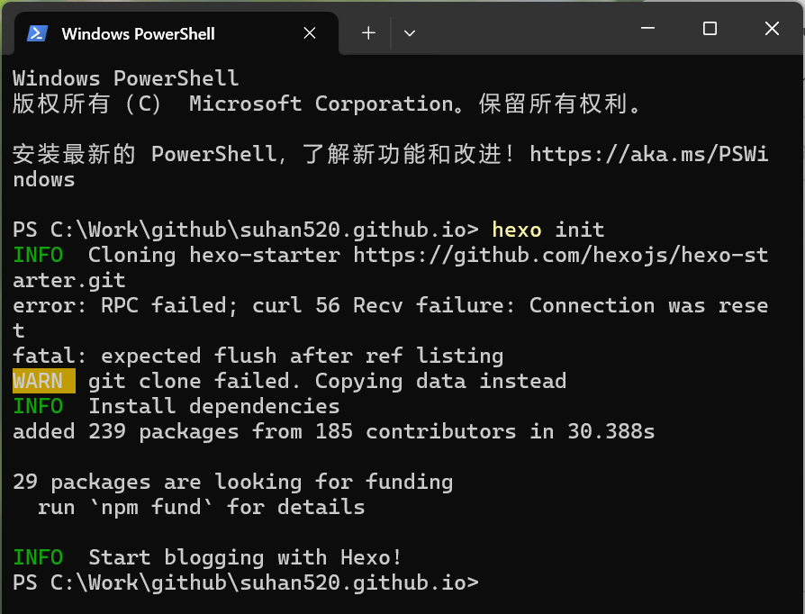
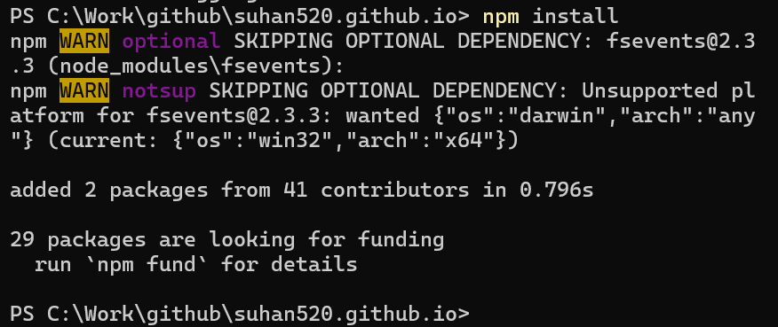
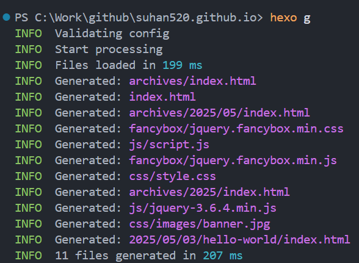
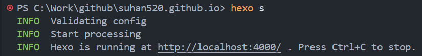
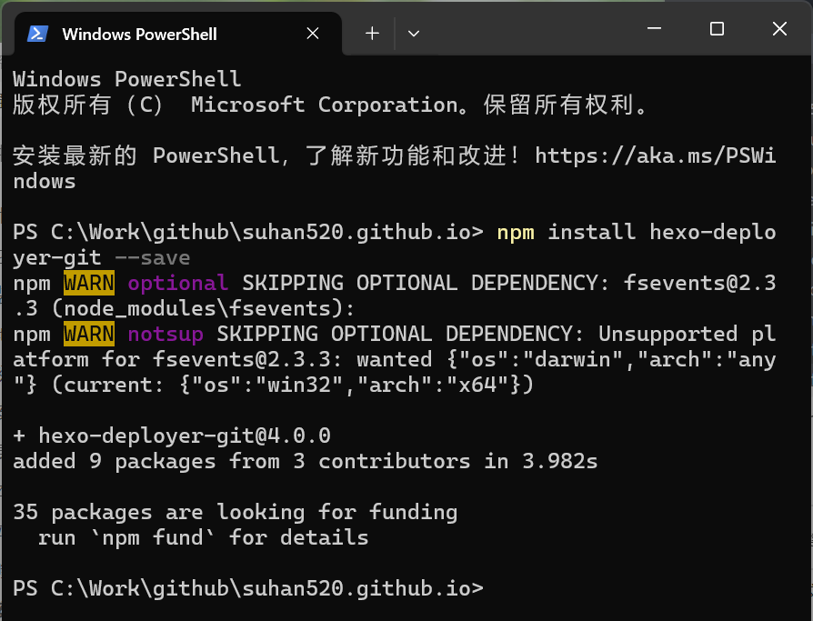

# Hexo博客开发

Hexo 是一个快速、简洁且高效的博客框架。 Hexo 使用 Markdown（或其他标记语言）解析文章，在几秒内，即可利用靓丽的主题生成静态网页。。

[文档 | Hexo](https://hexo.io/zh-cn/docs/)


## 要求

安装 Hexo 相当简单，只需要先安装下列应用程序即可：

- [Node.js](http://nodejs.org/) (Node.js 版本需不低于 10.13，建议使用 Node.js 12.0 及以上版本)
- [Git](http://git-scm.com/)

如果您的电脑中已经安装上述必备程序，那么恭喜您！ 你可以直接前往 安装 Hexo 步骤。

### 检查版本

```bash
node -v
npm -v
git --version
```


## 安装Hexo

使用`npm`安装hexo.

```bash
npm install -g hexo-cli
```

验证安装，执行下面命令：

```bash
hexo -v
```


## 本地流程

安装 Hexo 完成后，请执行下列命令，Hexo 将会在指定文件夹中新建所需要的文件。

### 初始化

在本地git库（这个文件夹需要是**空文件夹**）里面git bash

```bash
hexo init 	#初始化hexo
```



### 安装依赖

上面初始化执行完后，在新建的文件夹里面安装依赖。

```bash
npm install #安装所有依赖
```



### 更改.gitignore文件

`.gitignore`文件是一个纯文本文件，包含了项目中所有指定的文件和文件夹的列表，这些文件和文件夹是 Git 应该忽略和不追踪的。

在`.gitignore`中，你可以通过提及特定文件或文件夹的名称或模式来告诉 Git 只忽略一个文件或一个文件夹。你也可以用同样的方法告诉 Git 忽略多个文件或文件夹。

例如：

```
.DS_Store
Thumbs.db
db.json
*.log
node_modules/
public/
.deploy*/
_multiconfig.yml
*.code-workspace
.history
```

### 本地拉起服务

在VSCode打开终端，输入下面命令生成静态文件。

```bash
hexo generate #生成静态文件
hexo g
```



生成完静态文件之后，使用hexo server启动服务器。

```bash
hexo server
hexo s
```



然后打开浏览器，访问[localhost:4000](http://localhost:4000/)，你会看到博客启动了。


## 建站

### 修改配置文件

init之后修改里面的`_config.yml`文件（在文件最后）。

[配置 | Hexo](https://hexo.io/zh-cn/docs/configuration)

| 设置          | 描述                                                         |
| :------------ | :----------------------------------------------------------- |
| `title`       | 网站标题                                                     |
| `subtitle`    | 网站副标题                                                   |
| `description` | 网站描述                                                     |
| `keywords`    | 网站的关键词。 支持多个关键词。                              |
| `author`      | 您的名字                                                     |
| `language`    | 网站使用的语言。 使用 [2 个字母的 ISO-639-1 代码](https://en.wikipedia.org/wiki/List_of_ISO_639-1_codes)，或 [它的变体](https://hexo.io/docs/internationalization)。 默认为 `en`。 |
| `timezone`    | 网站时区。 Hexo 默认使用您电脑的时区。 请参考 [时区列表](https://en.wikipedia.org/wiki/List_of_tz_database_time_zones) 进行设置，如 `America/New_York`, `Japan`, 和 `UTC` 。 一般的，对于中国大陆地区可以使用 `Asia/Shanghai`。 |

基础要修改site和URL的配置。

```yml
# Site
title: suhan
subtitle: 'suhan blog'
description: 'suhan blog for hexo'
keywords: suhan, blog, hexo, suhan42
author: suhan
language: zh-CN
timezone: 'Asia/Shanghai'

# URL
## Set your site url here. For example, if you use GitHub Page, set url as 'https://username.github.io/project'
url: https://suhan520.github.io
permalink: :year/:month/:day/:title/
```

config.yml里的deploy的type要为git，repo中的地址http而不是https。

```yaml
deploy:
  type: git
  repository: git@github.com:suhan520/suhan520.github.io.git
  branch: main
```


### 安装一键部署插件

在当前文件夹中使用：

```bash
npm install hexo-deployer-git --save
```



如果上面报错就使用：

```bash
cnpm install hexo-deployer-git --save
```


## 部署到git

```bash
hexo clean #删除之前生成的文件，若未生成过静态文件，可忽略此命令。

hexo g	#生成静态文件

hexo deploy #部署网站，上传到github
hexo d 	#简写
```

以上内容可以简单复制

```bash
hexo clean && hexo generate && hexo deploy
```

如果出现`Deploy done`，则说明部署成功了。


这个时候再去git中打开对应的name.github.io就可以看到界面了。


## 一些报错

##### OpenSSL SSL_read: Connection was reset, errno 10054

解决办法：

1. 修改设置，解除SSL验证。打开 命令行工具， 输入：

```bash
git config --global http.sslVerify "false"
```

2. 在项目目录下打开命令行工具，输入`git init`，问题得到有效解决。 
